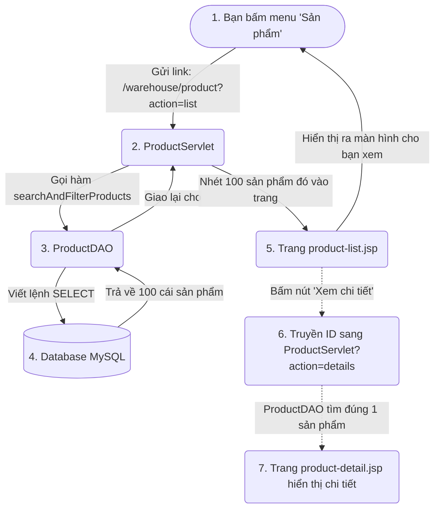
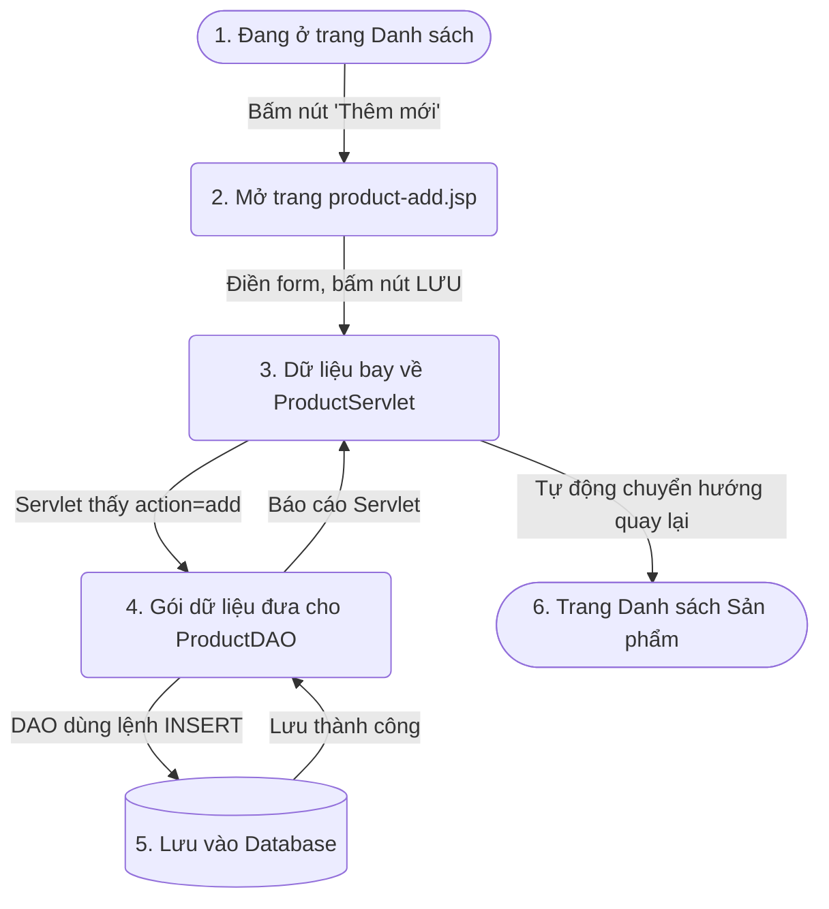
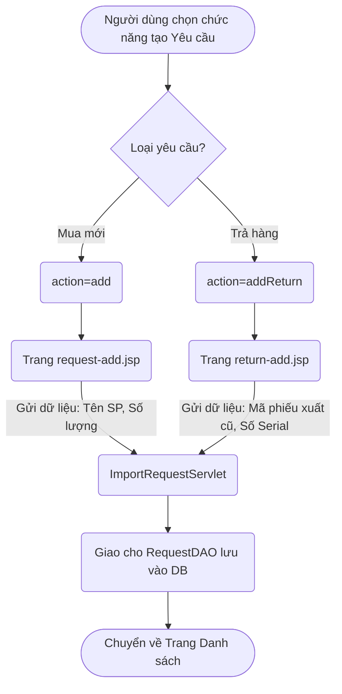
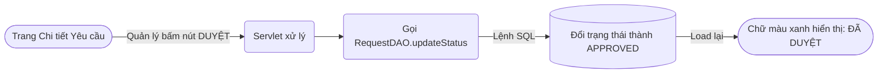
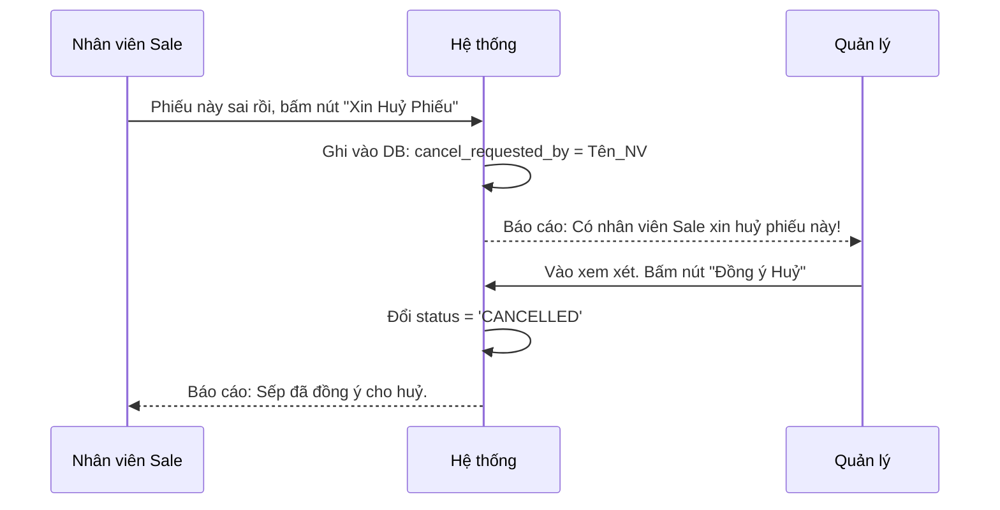

# 📖 Bí kíp Demo Môn SWP: Dành cho Học sinh (Dễ hiểu, Cực chi tiết)

Chào bạn, đây là bản hướng dẫn đã được "Việt hóa" hoàn toàn, loại bỏ các từ ngữ phức tạp. Chúng ta sẽ đi từng bước xem khi bạn bấm một nút trên màn hình, code ở dưới chạy vòng vèo ra sao để hiện ra trang web tiếp theo nhé!

---

## 📦 PHẦN 1: QUẢN LÝ SẢN PHẨM (PRODUCT)

Ở phần này, bạn tưởng tượng hệ thống có 3 "người" làm việc với nhau:
1.  **Trang web (Đuôi `.jsp`)**: Là cái giao diện bạn nhìn thấy, nơi có các nút bấm, khung điền chữ.
2.  **Người vận chuyển (Đuôi `Servlet.java`)**: Đứng giữa nhận yêu cầu từ trang web (ví dụ khi bạn bấm nút Lưu), rồi sai vặt người thứ 3 đi lấy hoặc cất dữ liệu. Sau đó cầm dữ liệu mang về cho trang web hiển thị.
3.  **Thủ kho (Đuôi `DAO.java`)**: Chỉ làm việc với kho chứa là Cơ sở dữ liệu (Database MySQL). Biết viết các câu lệnh SQL (`SELECT`, `INSERT`...).

### 1. Xem danh sách & Chi tiết Sản phẩm



**Cách nó nhảy trang:**
*   Khi bạn gõ URL hoặc bấm menu **Sản phẩm**, hệ thống nhảy vào file `ProductServlet.java`.
*   File này thấy chữ `action=list`, nó hiểu là "À, người dùng muốn xem danh sách".
*   Nó nhờ `ProductDAO.java` chui vào Database lấy bảng `Products` ra.
*   Lấy xong, nó mang cái mảng danh sách đó gắn vào file `product-list.jsp`. File `jsp` này có vòng lặp `for` để vẽ ra từng hàng trong cái bảng (table) bạn thấy trên màn hình.

**Nếu thầy bắt mở code:**
*   Mở `ProductServlet.java`, tìm chữ `case "list":` và `case "details":`.
*   Câu lệnh SQL ở `ProductDAO` để khoe: `SELECT p.*, c.category_name, b.brand_name FROM Products p...` (Lấy thông tin sản phẩm nối với tên danh mục và tên hãng).

### 2. Thêm mới (Add) và Sửa (Update) Sản phẩm



**Cách nó nhảy trang:**
*   Bạn điền tên, mã SKU xong bấm nút **Lưu** ở form. Thẻ `<form action="/warehouse/product?action=add" method="POST">` sẽ gom tất cả chữ bạn gõ, bắn sang `ProductServlet.java`.
*   Bên Servlet, code sẽ vớt từng chữ ra (bằng lệnh `request.getParameter("product_name")`).
*   Rồi đưa hết cho `ProductDAO` làm lệnh `INSERT INTO ...`
*   Lưu xong, dòng code `response.sendRedirect(...)` trong Servlet sẽ **đá bạn văng ngược lại** trang danh sách ban đầu để xem thành quả.

**Nếu thầy hỏi cách sửa (Update) thì sao?**
*   Y hệt Thêm mới, nhưng khi bấm nút **Lưu**, form gửi chữ `action=update` kèm theo cái `ID` của sản phẩm. DB thay vì dùng `INSERT` thì dùng lệnh `UPDATE Products SET ... WHERE id = ...`.

### 3. Kích hoạt / Vô hiệu hoá (Active/Deactive)

*   **Luồng hoạt động:** Trên màn hình danh sách có cái nút Bật/Tắt (Toggle). Bạn bấm 1 phát, nó gọi sang Servlet gửi cái `ID` và `action=toggle`.
*   **Điều gì xảy ra ở Database:** Gọi lệnh `UPDATE Products SET status = NOT status WHERE id = ?`. Nghĩa là đang Đúng (True) thì thành Sai (False) và ngược lại. Làm xong tự load lại trang danh sách.

---

## 🚛 PHẦN 2: YÊU CẦU NHẬP KHO (IMPORT REQUEST)

Nhập kho tức là khi cửa hàng hết đồ, Quản lý hoặc Nhân viên tạo một cái "Phiếu xin phép nhập đồ về" (gọi là Request). 

### 4. Tạo yêu cầu nhập kho (Có 2 loại: Nhập mới & Nhập trả hàng)

Ở hệ thống này, việc "Nhập kho" được chia làm 2 trường hợp cụ thể:

**Loại 1: Yêu cầu Nhập Mới (`action=add`)**
*   **Khi nào dùng:** Mua hàng mới từ Nhà cung cấp về kho.
*   **Luồng chạy:** Bấm nút tạo -> Mở trang `request-add.jsp` -> Chọn nhà cung cấp và số lượng món hàng -> Gửi về Servlet -> Lưu vào CSDL.

**Loại 2: Yêu cầu Nhập Lại / Trả Hàng (`action=addReturn`)**
*   **Khi nào dùng:** Khách hàng hoặc đối tác trả lại hàng cũ đã xuất đi trước đó.
*   **Luồng chạy:** Bấm menu "Tạo Return Request" -> Mở trang `return-add.jsp`.
*   **Điểm hay của hệ thống:** Ở giao diện trả hàng, bạn **KHÔNG** cần phải tự điền hay nhớ Mã Phiếu Xuất cũ. Việc duy nhất nhân viên Sale/Kinh doanh cần làm là **quét/nhập Mã Serial** của món hàng bị khách trả lại. Hệ thống sẽ tự động gọi API ngầm (AJAX) để truy tìm xem Serial này trước đây thuộc Phiếu xuất nào, của Khách hàng nào. Sau đó nó sẽ ngầm gắn Mã Phiếu Xuất đó (ẩn dưới form) rồi gửi về Servlet.



**Giải thích sự lắt léo khi Lưu vào DB (Thầy rất hay hỏi chỗ này):**
*   Khi tạo 1 phiếu nhập, có 2 thứ phải lưu: **Thông tin chung** (như mã phiếu, ngày tạo, nhà cung cấp) và **Chi tiết các món đồ** (nhập 10 áo thun, 5 quần đùi).
*   Thủ kho (`RequestDAO`) sẽ viết 2 câu lệnh SQL: 
    1. `INSERT INTO Requests` (Lưu thông tin chung).
    2. `INSERT INTO Request_Details` (Lưu từng món đồ một).
*   **Bí quyết:** Phải dùng thứ gọi là **Transaction** (giao dịch). Tức là phải lưu thành công CẢ HAI bảng thì mới đồng ý. Chứ lỡ lưu được cái vỏ phiếu mà mất danh sách đồ bên trong thì hỏng!

### 5. Duyệt (Approve) và Từ chối (Reject)



**Cách nó chạy:** 
Rất dễ, bấm nút **Duyệt**, hệ thống bắt được cái `ID` của phiếu, chạy lệnh SQL: `UPDATE Requests SET status = 'APPROVED' WHERE id = ?`.
Trạng thái trong Database đổi từ `PENDING` (chờ) sang `APPROVED` (đã duyệt). Lần tới load lại trang, JSP thấy chữ `APPROVED` nên nó tự động in ra màu xanh lá cây.

### 6. Huỷ yêu cầu đã duyệt (Cancel Request)

Đây là chức năng "Đề xuất huỷ" vì phiếu đã được Quản lý ký duyệt, nhân viên Sale không được tự tiện xé bỏ.



**Cách code chạy:**
1. **Bước 1 (Nhân viên xin huỷ):** Bấm nút -> Gọi Servlet (`action=cancel`) -> Chạy DAO -> `UPDATE Requests SET cancel_requested_by = 123` (Đánh dấu người xin huỷ).
2. **Bước 2 (Quản lý Duyệt huỷ):** Quản lý thấy phiếu có dấu hiệu "Xin huỷ", bấm nút "Duyệt Huỷ" -> Gọi Servlet (`action=approveCancel`) -> Chạy DAO -> `UPDATE Requests SET status = 'CANCELLED'`. Phiếu chính thức bị gạch bỏ.

---

## 💡 CÁCH ĐỐI PHÓ VỚI THẦY KHI DEMO (TIPS SỬA CODE)

Nếu thầy nói: *"Bây giờ em sửa cho tôi thế này..."*, đừng cuống, hãy làm theo các bước sau:

**Tình huống 1: "Thầy muốn tên sản phẩm không được nhập quá ngắn (phải > 3 chữ)."**
*   **Vào đâu:** `src/java/controller/warehouse/ProductServlet.java`.
*   **Chỗ nào:** Tìm dòng `case "add":` hoặc `case "update":`. Tìm đoạn lấy `productName` (`String productName = request.getParameter...`).
*   **Thêm code (ngay dưới đoạn đó):**
    ```java
    if (productName.length() < 3) {
        request.setAttribute("error", "Tên sản phẩm quá ngắn!");
        doGet(request, response);
        return;
    }
    ```

**Tình huống 2: "Thầy muốn khi từ chối (Reject) phiếu nhập kho thì không cần xoá, mà chữ nó phải màu Đỏ to lên."**
*   **Vào đâu:** Mở file giao diện `web/import_request/request-detail.jsp` (hoặc `request-list.jsp`).
*   **Chỗ nào:** Tìm chỗ nào có chữ `REJECTED` (thường nằm trong thẻ `<span>` hay `<badge>`).
*   **Sửa gì:** Thêm cái style cho nó: `style="color: red; font-size: 24px;"`
*   **Save lại và ra web bấm F5.** Giao diện tự đổi luôn!

**Tình huống 3: "Thầy muốn danh sách Yêu cầu Nhập xếp từ cũ tới mới thay vì mới tới cũ."**
*   **Vào đâu:** `src/java/dao/RequestDAO.java`.
*   **Chỗ nào:** Hàm `getAll(String type)` hoặc `getPendingOrApproved`.
*   **Sửa gì:** Tìm chuỗi `ORDER BY r.created_at DESC` đổi thành `ORDER BY r.created_at ASC` (Từ giảm dần thành tăng dần).
*   **Build lại project** chạy là xong.

> **Thần chú bình tĩnh:** Mọi nút bấm trên giao diện (`.jsp`) đều chui vào kho trung chuyển (`Servlet.java`), và Servlet sẽ nhờ ông thủ kho (`DAO.java`) làm việc với Database (`MySQL`). Cứ tìm từ Servlet là sẽ ra hết! Chúc bạn pass môn thành công 10 điểm! 🚀
