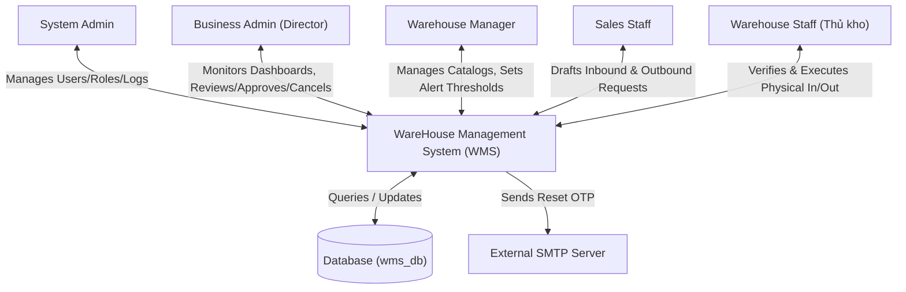
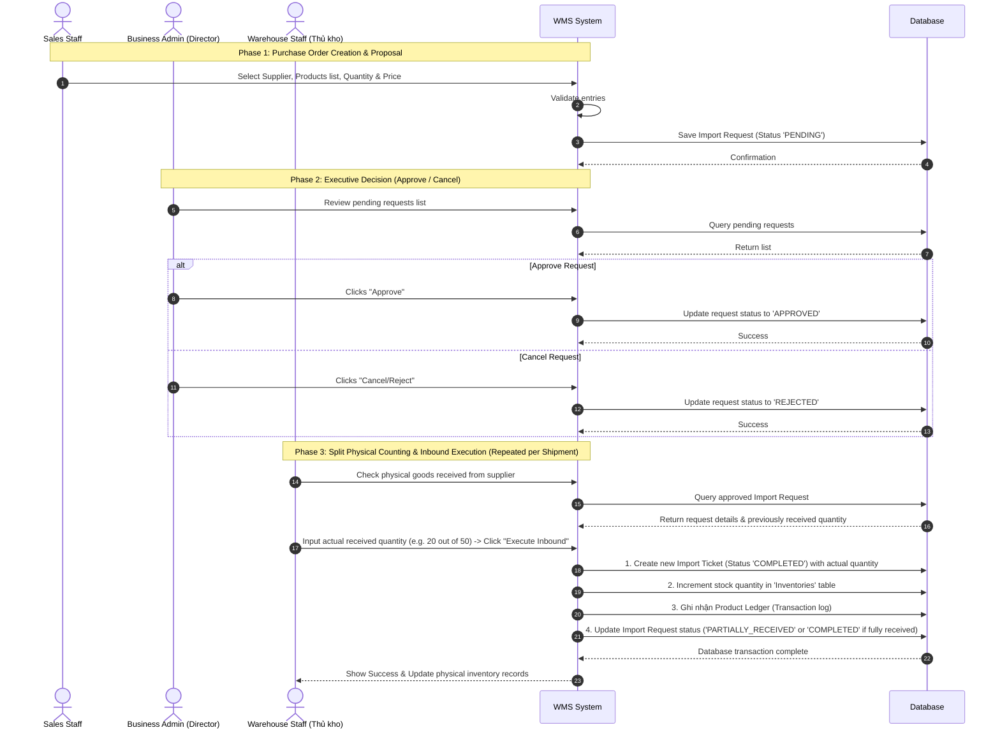
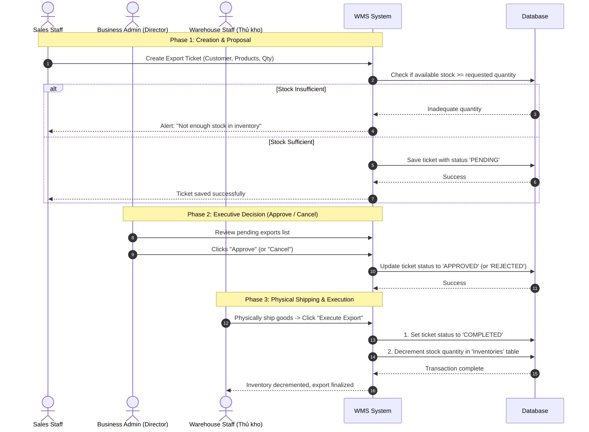
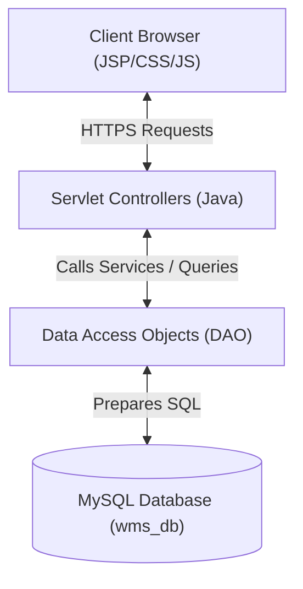
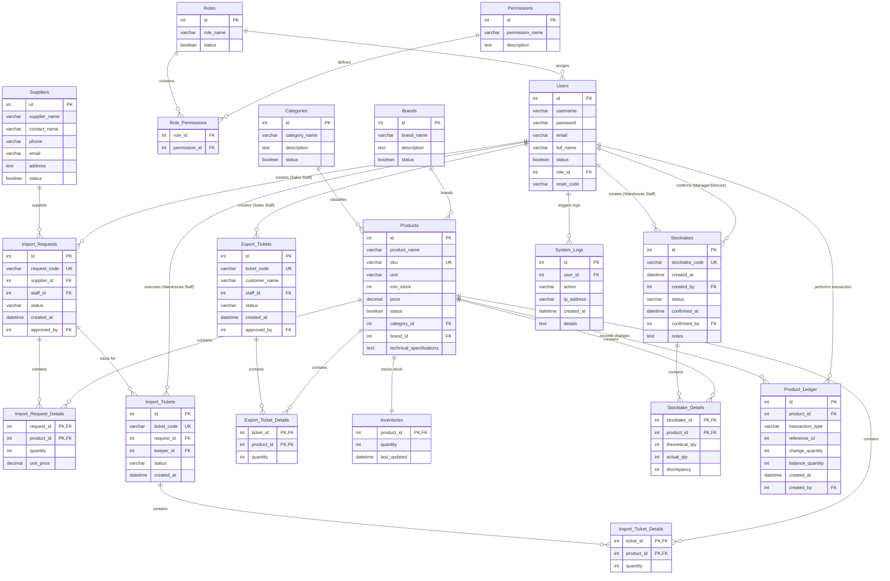

# Requirement & Design Specification
**WareHouse Management System (WMS)**  
**Version:** 1.2  
**Hanoi, May 2026**

---

## Record of Changes
| Version | Date | Action* | In charge | Change Description |
|---|---|---|---|---|
| V1.0 | 2026-05-20 | A | Project Team | Initial baseline for WMS functional scope. |
| V1.1 | 2026-05-20 | M | Project Team | Separated Business Admin (Director) and Warehouse Manager roles. |
| V1.2 | 2026-05-20 | M | Project Team | Added Sales Staff role and mapped import/export ticket creation to Sales. |

*\*A - Added, M - Modified, D - Deleted*

---

## Contents
- [I. Overview](#i-overview)
  - [1. System Context](#1-system-context)
  - [2. External Entities (Actors)](#2-external-entities-actors)
  - [3. Core Business Processes (Workflows)](#3-core-business-processes-workflows)
  - [4. Use Case Specifications](#4-use-case-specifications)
  - [5. System Functionalities & Screen Matrix](#5-system-functionalities--screen-matrix)
- [II. Functional Requirements (Screen Spec)](#ii-functional-requirements-screen-spec)
  - [1. User Authentication](#1-user-authentication)
  - [2. System Administration (System Admin)](#2-system-administration-system-admin)
  - [3. Master Data Management (Warehouse Manager)](#3-master-data-management-warehouse-manager)
  - [4. Sales & Invoicing Operations (Sales Staff)](#4-sales--invoicing-operations-sales-staff)
  - [5. Inventory Execution (Warehouse Staff)](#5-inventory-execution-warehouse-staff)
  - [6. Business Intelligence & Audit (Business Admin / Director)](#6-business-intelligence--audit-business-admin--director)
- [III. System Design](#iii-system-design)
  - [1. Software Architecture](#1-software-architecture)
  - [2. Code Package Design](#2-code-package-design)
  - [3. Database Design (ERD & Data Dictionary)](#3-database-design-erd--data-dictionary)

---

## I. Overview

### 1. System Context
The **WareHouse Management System (WMS)** is an enterprise web application designed to regulate, track, and optimize warehouse operations. The system strictly separates corporate business monitoring (Business Admin / Director), commercial operations (Sales Staff), daily facility control (Warehouse Manager), physical storage logistics (Warehouse Staff), and configuration parameters (System Admin) using Role-Based Access Control (RBAC).

Below is the **System Context Diagram** using Mermaid. Copy this code into [mermaid.live](https://mermaid.live) to render:



### 2. External Entities (Actors)
To prevent internal fraud and ensure robust organizational integrity, the system divides operational duties among **five internal roles**:

| # | Entity / Actor | Business Persona | Core Scope of Duties |
|---|---|---|---|
| **1** | **System Admin** | IT / Systems Administrator | Governs user accounts, roles mapping, permission matrices, and monitors core system activity logs. |
| **2** | **Business Admin** | Warehouse Director / Owner | The executive head. Holds the ultimate authority. Analyzes dashboards, and **approves or cancels** Import & Export tickets. Does not touch daily stock entries. |
| **3** | **Warehouse Manager** | Warehouse Operations Manager | The operational manager. Manages products catalogue, supplier lists, and sets warehouse safety stock levels. |
| **4** | **Sales Staff** | Sales / Purchase Agent | Commercial front. Interacts with suppliers and customers. **Creates draft Import Tickets** (upon stock demand) and **creates draft Export Tickets** (upon sales orders). |
| **5** | **Warehouse Staff** | Warehouse Keeper (Thủ kho) | Floor logistics operator. Checks physical inventory, counts items, and clicks **"Execute"** on approved tickets to update stock levels. |

---

### 3. Core Business Processes (Workflows)

#### 3.1 Inbound Operation (Import Process)
The Import process ensures that goods bought from suppliers are verified and systematically counted before incrementing the inventory.



#### 3.2 Outbound Operation (Export Process)
The Export process prevents stockouts by validating quantities before allowing goods to leave the warehouse for customer fulfillment.



---

### 4. Use Case Specifications

The complete Use Case Matrix for WMS:

| ID | Use Case Name | Feature Module | Primary Actor | Description |
|---|---|---|---|---|
| **UC01** | Login | Auth | Guest / User | Log in to access the system dashboard. |
| **UC02** | Reset Password | Auth | Guest | Reset password using a 6-digit email OTP. |
| **UC03** | Manage Profile | Auth | System User | Edit names, view emails, and change password. |
| **UC04** | Manage Users | Admin | System Admin | CRUD users, activate/deactivate accounts. |
| **UC05** | Manage RBAC | Admin | System Admin | Configure dynamic role-to-permission mapping. |
| **UC06** | Manage Suppliers | Master Data | Warehouse Manager | Manage contact details of supplier companies. |
| **UC07** | Manage Products | Master Data | Warehouse Manager | Manage inventory item types, SKU, unit, and safety stock. |
| **UC08** | Create Import Ticket | Operations | Sales Staff | Input supplier and draft items to import (PENDING). |
| **UC09** | Create Export Ticket | Operations | Sales Staff | Input customer details and items to export (PENDING). |
| **UC10** | Review & Approve Ticket| Operations | Business Admin (Director)| Review pending imports/exports, confirm or cancel them. |
| **UC11** | Execute Stock In/Out | Operations | Warehouse Staff | Confirm physical movement of goods to update stock levels. |
| **UC12** | Monitor Inventory | Stock Control | All Users | View real-time stock levels and low-stock alerts. |
| **UC13** | View Executive Dashboard | Reports | Business Admin (Director)| Analyze high-level financial health, cost, and warehouse capacity. |
| **UC14** | Export Business Reports | Reports | Business Admin (Director)| Generate and export CSV/Excel sheets for stock valuation and costs. |

#### Consolidated Use Case Diagram
Copy this to [mermaid.live](https://mermaid.live) to render the full functional scope:

```mermaid
left-to-right direction
graph TD
    subgraph Users
        Guest((Guest))
        User((System User))
        Sales((Sales Staff))
        WKeeper((Warehouse Staff))
        WManager((Warehouse Manager))
        Director((Business Admin / Director))
        SAdmin((System Admin))
    end

    subgraph Authentication Module
        Guest --> UC1[UC01: Login]
        Guest --> UC2[UC02: Reset Password]
        User --> UC3[UC03: Manage Profile]
    end

    subgraph Administration Module
        SAdmin --> UC4[UC04: Manage Users]
        SAdmin --> UC5[UC05: Manage RBAC Mapping]
    end

    subgraph Master Data & Catalog Setup
        WManager --> UC6[UC06: Manage Suppliers]
        WManager --> UC7[UC07: Manage Products]
    end

    subgraph Commercial Operations
        Sales --> UC8[UC08: Create Import Ticket]
        Sales --> UC9[UC09: Create Export Ticket]
    end

    subgraph Verification & Approval
        Director --> UC10[UC10: Approve/Cancel Tickets]
        WKeeper --> UC11[UC11: Execute Stock In/Out]
        User --> UC12[UC12: Monitor Stock & Alerts]
    end

    subgraph Executive Analytics
        Director --> UC13[UC13: View Executive Dashboard]
        Director --> UC14[UC14: Export Business Reports]
    end
```

---

### 5. System Functionalities & Screen Matrix

The screen map outlining access capabilities across specific roles:

| Screen Name | JSP File | System Admin | Business Admin (Director) | Warehouse Manager | Sales Staff | Warehouse Staff (Keeper) |
|---|---|:---:|:---:|:---:|:---:|:---:|
| **Executive Dashboard** | `dashboard_director.jsp` | | **X** | | | |
| **Operational Dashboard** | `index.jsp` | | | **X** | **X** | **X** |
| **User Management** | `/admin/user-list.jsp` | **X** | | | | |
| **Role & Permission Management** | `/admin/role-list.jsp` | **X** | | | | |
| **Product List & SKU Setup** | `/products/product-list.jsp` | | | **X (Full CRUD)** | **X (Read-only)** | **X (Read-only)** |
| **Supplier Profiles** | `/suppliers/supplier-list.jsp` | | | **X (Full CRUD)** | **X (Read-only)** | **X (Read-only)** |
| **Import Tickets Log** | `/imports/import-list.jsp` | | **X (Approve/Cancel)** | **X (Read-only)** | **X (Create)** | **X (Execute)** |
| **Export Tickets Log** | `/exports/export-list.jsp` | | **X (Approve/Cancel)** | **X (Read-only)** | **X (Create)** | **X (Execute)** |
| **Stock Inventory Levels** | `/inventory/stock-list.jsp` | | **X (Read-only)** | **X (Read-only)** | **X (Read-only)** | **X (Read/Write)** |

---

## II. Functional Requirements (Screen Spec)

### 1. User Authentication
*   **Login (`login.jsp`):** Validates credentials, redirects System Admin to User List, Business Admin (Director) to `dashboard_director.jsp`, Warehouse Manager/Sales/Warehouse Staff to `index.jsp` with personalized operational triggers.

### 2. System Administration (System Admin)
*   **User Management (`/admin/user-list.jsp`):** Activates or deactivates accounts. Changes role assignments dynamically.

### 3. Master Data Management (Warehouse Manager)
*   **Product & Supplier Registry:** Warehouse Manager manages items (SKU, Name, Unit, min_stock) and Supplier profiles.

### 4. Sales & Invoicing Operations (Sales Staff)
*   **Create Import Ticket (`/imports/import-add.jsp`):** Allows Sales Staff to select a Supplier and products to propose for purchase. Saved as `PENDING`.
*   **Create Export Ticket (`/exports/export-add.jsp`):** Allows Sales Staff to input Customer details and select products to request for delivery. System validates real-time quantity availability from `Inventories`. Saved as `PENDING`.

### 5. Inventory Execution (Warehouse Staff)
*   **Stock Mutation Execution (`/inventory/stock-list.jsp`):** Displays tickets with `APPROVED` status. Warehouse Staff physically counts the items and clicks **"Execute Stock Mutation"** to update inventory records and set status to `COMPLETED`.

### 6. Business Intelligence & Audit (Business Admin / Director)
*   **Review Dashboard (`dashboard_director.jsp`):** Displays pending import/export queues. The Director can click **"Confirm/Approve"** (updates status to `APPROVED`) or **"Cancel/Reject"** (updates status to `REJECTED`). Includes complete read-only executive charts.

---

## III. System Design

### 1. Software Architecture
This application uses a pure MVC architecture utilizing standard Java Enterprise components:



---

### 2. Code Package Design

*   `controller`: Base servlet classes (`LoginServlet`, `ForgotPasswordServlet`).
*   `controller.admin`: Administrative capabilities (`UserServlet`, `RoleServlet`).
*   `controller.warehouse`: Operational servlets (`ProductServlet`, `SupplierServlet`, `ImportServlet`, `ExportServlet`, `InventoryServlet`).
*   `controller.director`: Executive dashboard servlets (`DirectorDashboardServlet`, `ReportExportServlet`).
*   `dao`: JDBC interactions (`UserDAO`, `RoleDAO`, `ProductDAO`, `SupplierDAO`, `InventoryDAO`, `ReportDAO`).
*   `model`: Dynamic POJOs (`User`, `Role`, `Permission`, `Product`, `Supplier`, `ImportTicket`, `ExportTicket`).
*   `utils`: Hashing tools (`SecurityUtils`) and JDBC connectors (`DBUtils`).

---

### 3. Database Design (ERD & Data Dictionary)

#### 3.1 Extended Entity-Relationship Diagram (ERD)
Copy this DDL representation into [mermaid.live](https://mermaid.live) to render the full ERD:



---

#### 3.2 Data Dictionary (Table Schemas)

Refer to Version 1.1 for standard schemas. Key changes are that `Import_Tickets(staff_id)` and `Export_Tickets(staff_id)` refer to the **Sales Staff** user account, and `approved_by` refers to the **Business Admin (Director)** user account.
